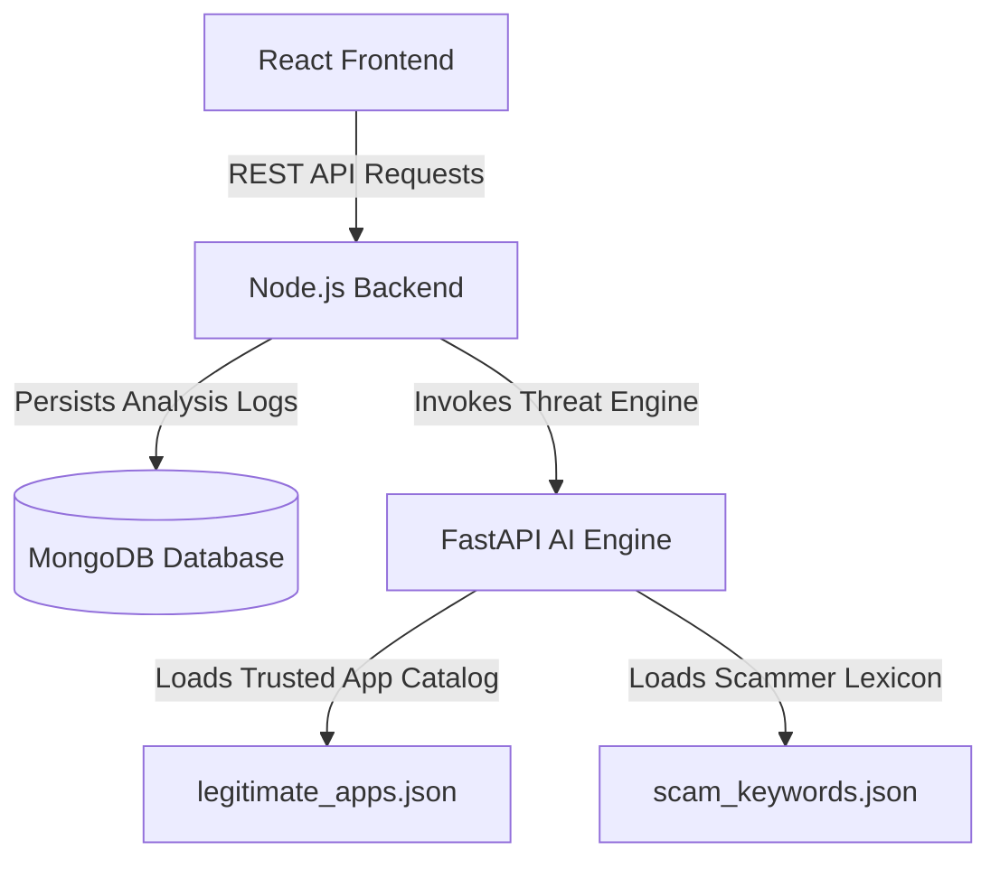

# SentinelAI - Backend & AI Engine
> **"Unmasking Fake Apps. Securing Real Trust."**

SentinelAI is an AI-powered cyber defense platform built for law enforcement, cybercrime prevention teams, and everyday investors. It proactively detects fake and look-alike investment applications designed by cybercriminals to impersonate legitimate financial institutions.

---

## 📖 Table of Contents
1. [Problem Statement](#-problem-statement)
2. [Project Objective](#-project-objective)
3. [Architecture Overview](#-architecture-overview)
4. [AI Engine Detection Modules (MVP)](#-ai-engine-detection-modules-mvp)
5. [Risk Scoring & Formula](#-risk-scoring--formula)
6. [API Specifications](#-api-specifications)
7. [Future Enhancements](#-future-enhancements)
8. [Setup & Running Instructions](#-setup--running-instructions)

---

## 🚨 Problem Statement
Cybercriminals frequently build look-alike malicious apps that spoof legitimate Indian fintech/investment platforms such as **Groww, Zerodha, Upstox, Angel One, Paytm Money, and ICICI Direct**. 

These applications deceive users by:
* Using names that closely resemble trusted brands (e.g., "Groww Wealth Pro").
* Copying logos, brand colors, and layout templates.
* Making unrealistic promises (e.g., "double your money", "guaranteed 100% profit").
* Tricking users into sharing credentials, OTPs, and deposits.

---

## 🎯 Project Objective
To build a highly modular, explainable, and fast AI-powered threat analysis platform. The engine scans app metadata (name, description text) and provides a combined risk percentage along with natural-language justifications for the risk classification, enabling citizens and law enforcement to preemptively flags scams.

---

## 🏗️ Architecture Overview

SentinelAI uses a clean microservices-based layout to decouple frontend visuals from the risk assessment backend:



* **Frontend**: React (interactive dashboards, upload portals, visual feedback).
* **Backend**: Node.js & Express (session management, audit logging, threat history).
* **AI Engine**: FastAPI (Python-based similarity models and NLP keyword engines).
* **Database**: MongoDB (saves scan logs, telemetry, and platform status).

---

## 🧠 AI Engine Detection Modules (MVP)

### 1. Name Similarity Module (`name_detector.py`)
Matches incoming app names against a trusted repository (`legitimate_apps.json`) using **RapidFuzz**'s token-matching logic (`WRatio`). It handles extra spaces, casing variants, and minor typos.
* **$\ge 90\%$ Similarity**: Risk Score: `90` (Immediate brand spoofing threat).
* **$80\%\text{ - }89\%$ Similarity**: Risk Score: `70` (Highly similar).
* **$70\%\text{ - }79\%$ Similarity**: Risk Score: `50` (Partial similarity).
* **$< 70\%$ Similarity**: Risk Score: `10` (Safe/unrelated name).

### 2. Description Analysis Module (`text_detector.py`)
Scans description text for malicious or unrealistic promises loaded dynamically from `scam_keywords.json` (e.g., "instant income", "risk free").
* **0 Matches**: Risk Score: `0`
* **1 Match**: Risk Score: `25`
* **2 Matches**: Risk Score: `50`
* **3 Matches**: Risk Score: `75`
* **$\ge 4$ Matches**: Risk Score: `90`

### 3. Placeholder Logo Module (`logo_detector.py`)
A placeholder module laid out for upcoming computer vision pipelines. Future phases will integrate:
* **PIL (Pillow)** for image loading and preprocessing.
* **ImageHash** for generating perceptual hashes to find visually modified templates.
* **OpenCV (cv2)** utilizing feature-matching frameworks (SIFT/ORB) to check for absolute logo forgery.

---

## 📊 Risk Scoring & Formula

The Central Risk Engine combines scores from the text and name modules to form a single, balanced metric:

$$\text{Final Risk Score} = \text{round}(0.6 \times \text{Name Risk} + 0.4 \times \text{Description Risk})$$

### Risk Status Mapping:
* **$0\text{ - }30$**: `Safe`
* **$31\text{ - }60$**: `Suspicious`
* **$61\text{ - }100$**: `High Risk`

---

## 🔌 API Specifications

### 1. Health Status (`GET /health`)
* **Endpoint**: `/health`
* **Description**: Verifies if the FastAPI risk engine is online.
* **Response**:
  ```json
  {
    "status": "running"
  }
  ```

### 2. Analyze Application (`POST /analyze`)
* **Endpoint**: `/analyze`
* **Description**: Submits app metrics to the AI Engine for scoring.
* **Request Payload**:
  ```json
  {
    "app_name": "Groww Wealth Pro",
    "description": "Guaranteed returns and risk free income."
  }
  ```
* **Response**:
  ```json
  {
    "app_name": "Groww Wealth Pro",
    "final_risk_score": 74,
    "status": "High Risk",
    "name_analysis": {
      "matched_app": "Groww",
      "similarity_score": 90,
      "risk_score": 90,
      "reason": "App name is highly similar to Groww"
    },
    "description_analysis": {
      "risk_score": 50,
      "matched_keywords": [
        "guaranteed returns",
        "risk free"
      ],
      "reason": "Multiple suspicious investment claims detected"
    }
  }
  ```

---

## 🚀 Setup & Running Instructions

### Prerequisites
* Python 3.10+
* Node.js (for the main backend integration)

### Running the FastAPI AI Engine
1. Navigate to the `ai-engine` directory:
   ```bash
   cd ai-engine
   ```
2. Activate your Python virtual environment:
   ```bash
   # Windows PowerShell:
   ..\venv\Scripts\Activate.ps1
   ```
3. Run the FastAPI development server:
   ```bash
   uvicorn main:app --reload
   ```
4. Access the interactive API docs at: [http://127.0.0.1:8000/docs](http://127.0.0.1:8000/docs)

---

## 🔮 Future Enhancements (Post-MVP)
* **Computer Vision Brand Comparison**: Integrate PIL, ImageHash, and OpenCV template matchers to inspect uploaded app icons.
* **APK Static Analysis**: Read compilation certificates, developer signatures, and embedded endpoint URLs to isolate command-and-control servers.
* **NLP & ML Classifiers**: Upgrade the basic keyword regex to transformer-based classifier models (e.g., BERT) to detect semantic evasion techniques.